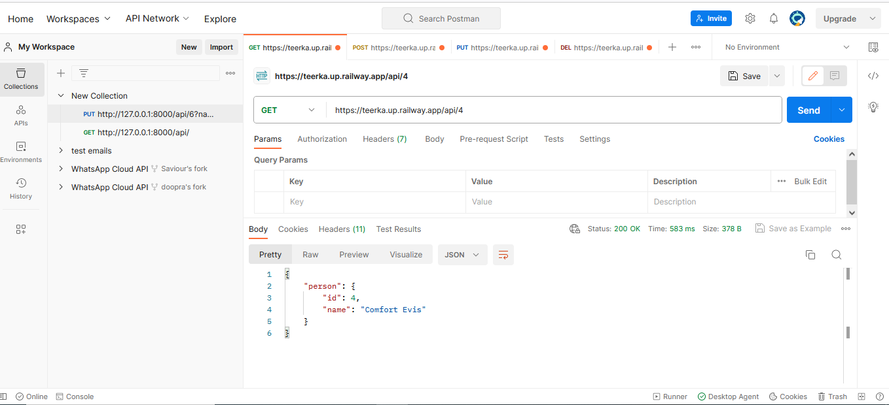
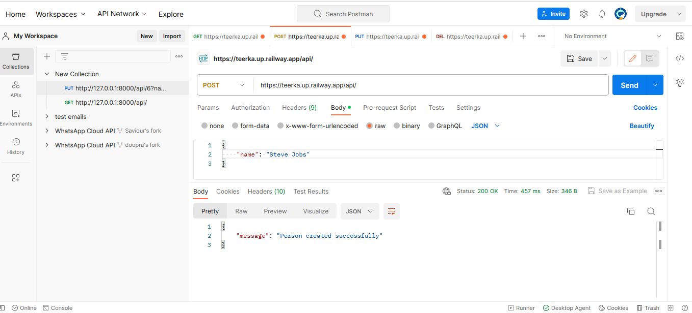
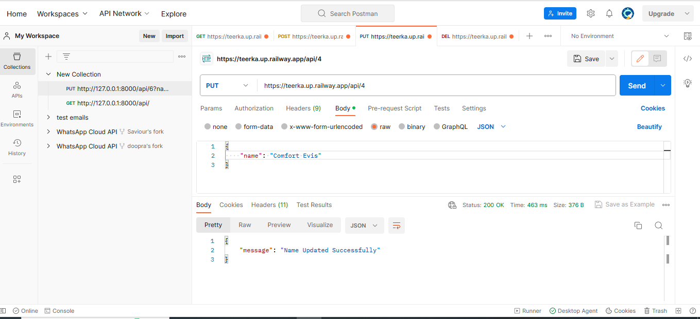
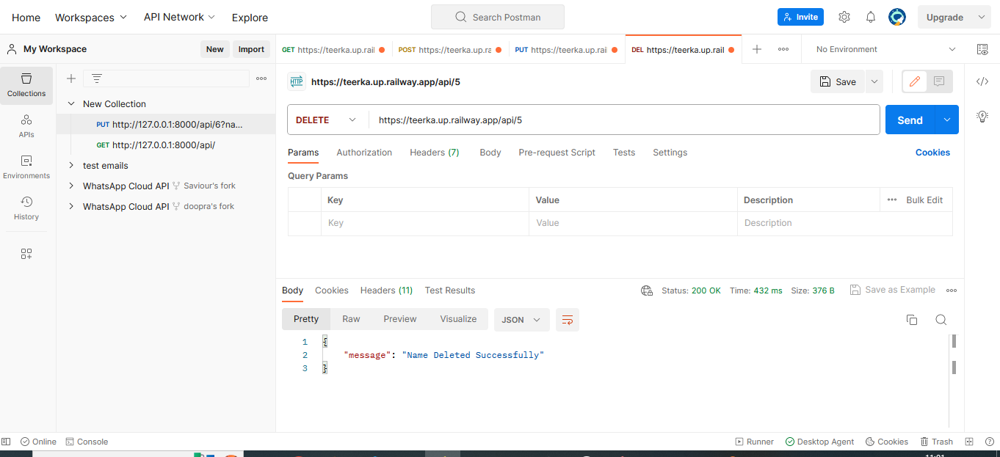
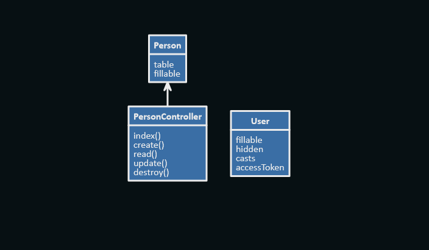

# Person API

This README provides an overview of a CRUD (Create, Read, Update, Delete) project implemented in PHP using the Laravel framework. This project focuses on managing a list of persons with their names.

## Project Overview

The CRUD project is designed to perform basic operations on a collection of person records, including creating, reading, updating, and deleting individual records. The project utilizes Laravel, a popular PHP framework, to build the API endpoints for these operations.

## CRUD Operations

### Read (GET /api/)

The index method retrieves all person records from the database and returns them as JSON. If no records are found, a 404 status response is returned.

### Create (POST /api/)

The create method is used to add a new person to the database. It performs the following steps:

1.  Validates the input data, ensuring that the name is required, a string, and within a character limit.
2.  Checks if a person with the same name already exists in the database.
3.  Creates a new person record if the name doesn't exist.

### Read Single (GET /api/{id})

The read method takes an ID as a parameter and retrieves a single person record by that ID. If the person is found, it returns the details in JSON format; otherwise, a 400 status response is returned.

### Update (PUT /api/{id})

The update method updates an existing person's name based on the provided ID. It follows these steps:

1.  Validates the input data, ensuring that the name is required, a string, and within a character limit.
2.  Checks if the new name is unique.
3.  Updates the name if the person exists; otherwise, returns a 400 status response.

### Delete (DELETE /api/{id})

The destroy method deletes a person record based on the provided ID. If the person exists, it is deleted, and a success message is returned. If no person is found, a 400 status response is returned.

### Prerequisites

Before you begin, ensure you have met the following requirements:

*   Node.js and npm installed on your machine.
*   Database (e.g., MySQL, PostgreSQL)
*   Git installed (for cloning the repository).
*   PHP (>= 7.4)
*   Laravel (>= 8.x)
*   Composer

### Installation

1.  Clone the repository:

        git clone https://github.com/Doopra/crud-api.git
        

2.  Change into the project directory:

        cd crud-api

3.  Install the required Node.js packages:

        npm install

4.  Create a .env file by copying the .env.example file and configure your database settings:

        cp .env.example .env

    Configure the database config variables as follows:

        DB_CONNECTION=mysql
        DB_HOST=127.0.0.1
        DB_PORT=3306
        DB_DATABASE=laravel
        DB_USERNAME=root
        DB_PASSWORD=

5.  Run the migrations:

        php artisan migrate

6.  Start the development server:

        php artisan serve

The Laravel API is currently operational at the base URL: {http://localhost:8000}.

### Sample Usage

### Fetch the details of a person (Read)

### Adding a new person (create)

### Modify the details of an existing person (Update)

### Delete a person 

### Running the API

* The endpoint accepts JSON as input    

### API Endpoints

    
*   GET /api: Retrieve a list of all persons.
*   GET /api/id: Retrieve details of a specific person by their name.
*   POST /api: Create a new person record.
*   PUT /api/id: Update the details of a specific person.
*   DELETE /api/id: Delete a person record.

### Source Code
 [Github Repo](https://github.com/Doopra/crud-api)

 ### UML Diagram

 

